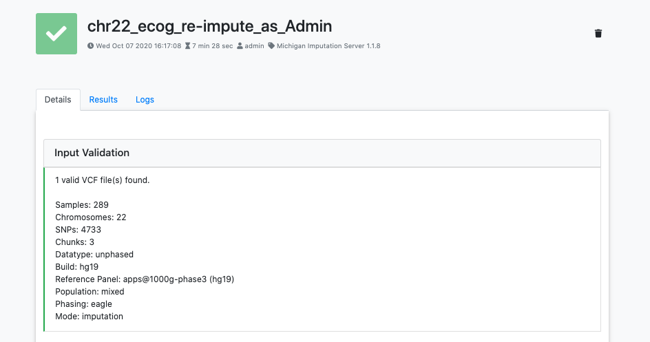
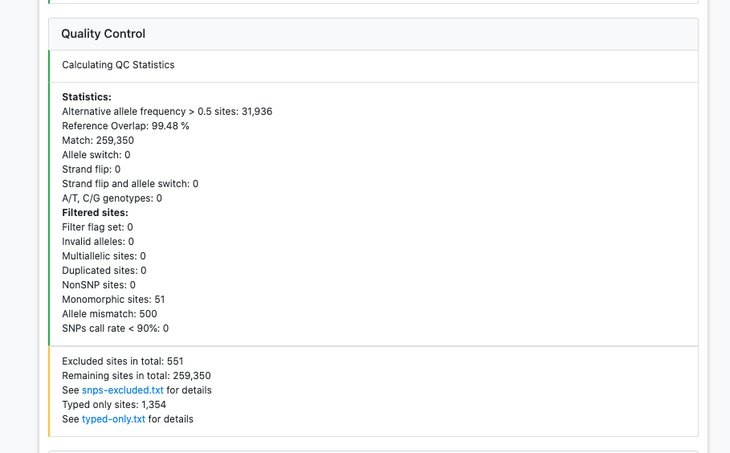
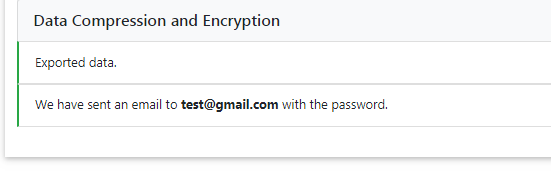

# Getting Started

To use Qatar Imputation Server, a [registration](http://imputation.sidra:8082/index.html#!pages/register) is required. We send an activation mail to the provided address. Please follow the instructions in the email to activate your account. If it doesn't arrive, ensure you have entered the correct email address and check your spam folder.

**After the email address has been verified, the service can be used without any costs.**

## Setting your first imputation job

Please login with your credentials and click on the **Run** tab to start a new imputation job. The submission dialog allows you to specify the properties of your imputation job.

The following options are available:

### Reference Panel

Our server offers genotype imputation from different reference panels. The most accurate and largest panel is **HRC (Version r1.1 2016)**. Please select one that fulfills your needs and supports the population of your input data:

* HRC (Version r1.1 2016)
* HRC (Version r1 2015)
* 1000 Genomes Phase 3 (Version 5)
* 1000 Genomes Phase 1 (Version 3)
* CAAPA - African American Panel
* HapMap 2
* TOPMed Freeze5 (in preparation)

### Input files

VCF files can be uploaded either from your local disk or by specifying a remote sftp / HTTPS location. In both cases, several files or several locations can be selected at once. Please make sure that all files fulfill the [requirements]().

### Upload VCF files from your computer

When using the file upload, data is uploaded from your local file system to Qatar Imputation Server. By clicking on **Select Files** an open dialog appears where you can select your VCF files:

Multiple files can be selected using the ***ctrl, cmd or shift*** keys, depending on your operating system. After you have confirmed your choice, all selected files are listed in the submission dialog:

### Import VCF files via SFTP

An other convenient way to use your data is by importing it directly from a remote SSH server. This can be achieved by selecting **Secure File Transfer Protocol (SFTP)**.

After clicking on the **Import Files** button, a new dialog appears where you can enter your SFTP credentials and the URLs of your files or folders. A URL consists of the server address followed by the full Unix path. A path can be either point to a folder or to a file. Several paths can be specified in consecutive lines.

### Import VCF files via HTTPS

Data can also be imported by using HTTP(S) link. This can be achieved by selecting **URLs (HTTP)**.

After clicking on the **Add URLs** button, a new dialog appears where you can add the links.

### Build

Please select the build of your data. Currently the options **hg19** and **hg38** are supported. Qatar Imputation Server automatically updates the genome positions (liftOver) of your data. All reference panels except TOPMed are based on hg19 coordinates.

### rsq Filter

To minimize the file size, Qatar Imputation Server includes a r2 filter option, excluding all imputed SNPs with a r2-value (= imputation quality) smaller then the specified value.

### Phasing

If your uploaded data is unphased, Eagle v2.4 will be used for phasing. In case your uploaded VCF file already contains phased genotypes, please select the "No phasing" option.

| Algorithm  | Description                                                                                                                                                                                                              |
|------------|--------------------------------------------------------------------------------------------------------------------------------------------------------------------------------------------------------------------------|
| Eagle v2.4 | The Eagle algorithm estimates haplotype phase using the HRC reference panel. This method is also suitable for single sample imputation. After phasing or imputation you will receive phased genotypes in your VCF files. |

 

### Population

Please select the population of your uploaded samples. This information is used to compare the allele frequencies between your data and the reference panel.

| Population | Supported Reference Panels       |
|------------|----------------------------------|
|     AFR    |                all               |
|     AMR    |                all               |
|     EUR    |                all               |
|    Mixed   |                all               |
|     AA     |               CAAPA              |
|     ASN    | 1000 Genomes Phase 1 (version 3) |
|     EAS    | 1000 Genomes Phase 3 (version 5) |
|     SAS    | 1000 Genomes Phase 3 (version 5) |  

Please note that not every reference panel supports all sub-populations.

### Mode

Please select if you want to run **Quality Control & Imputation, Quality Control & Phasing Only or Quality Control Only**.

### AES 256 encryption

All Imputation Server results are encrypted by default. Please tick this checkbox if you want to use AES 256 encryption instead of the default encryption method. Please note that AES encryption does not work with standard unzip programs. We recommend to use 7z instead.

## Start your imputation job

After confirming our Terms of Service, the imputation process can be started immediately by clicking on Start Imputation. Input Validation and Quality Control are executed immediately to give you feedback about the data-format and its quality. If your data passed this steps, your job is added to our imputation queue and will be processed as soon as possible. You can check the position in the queue on the job summary page.

We notify you by email as soon as the job is finished or your data don't pass the Quality Control steps.

### Input Validation

In a first step we check if your uploaded files are valid and we calculate some basic statistics such as amount of samples, chromosomes and SNPs.

After Input Validation has finished, basic statistics can be viewed directly in the web interface.

If you encounter problems with your data please read this tutorial about Data Preparation to ensure your data is in the correct format.

### Quality Control

In this step we check each variant and exclude it in case of:

1. contains invalid alleles
2. duplicates
3. indels
4. monomorphic sites
5. allele mismatch between reference panel and uploaded data
6. SNP call rate < 90%

All filtered variants are listed in a file called statistics.txt which can be downloaded by clicking on the provided link.

If you selected a population, we compare the allele frequencies of the uploaded data with those from the reference panel. The result of this check is available in the QC report and can be downloaded by clicking on qcreport.html.

### Pre-phasing and Imputation

Imputation is achieved with Minimac4. The progress of all uploaded chromosomes is updated in real time and visualized with different colors.

### Data Compression and Encryption

If imputation was successful, we compress and encrypt your data and send you a random password via mail.

This password is not stored on our server at any time. Therefore, if you lost the password, there is no way to resend it to you.

## Download results

The user is notified by email, as soon as the imputation job has finished. A zip archive including the results can be downloaded directly from the server. To decrypt the results, a one-time password is generated by the server and included in the email. The QC report and filter statistics can be displayed and downloaded as well.

### Download via a web browser

All results can be downloaded directly via your browser by clicking on the filename.

In order to download results via the commandline using **wget or aria2** you need to click on the share symbol (located right to the file size) to get the needed private links.

### Share Data

A new dialog appears which provides you the private link. Click on the tab wget command to get a copy & paste ready command that can be used on Linux or MacOS to download the file in your terminal.

### Download all results at once

To download all files of a folder (for example folder **Imputation Results**) you can click on the **share** symbol of the folder:

A new dialog appears which provides you all private links at once. Click on the tab **wget commands** to get copy & paste ready commands that can be used on Linux or MacOS to download all files.

