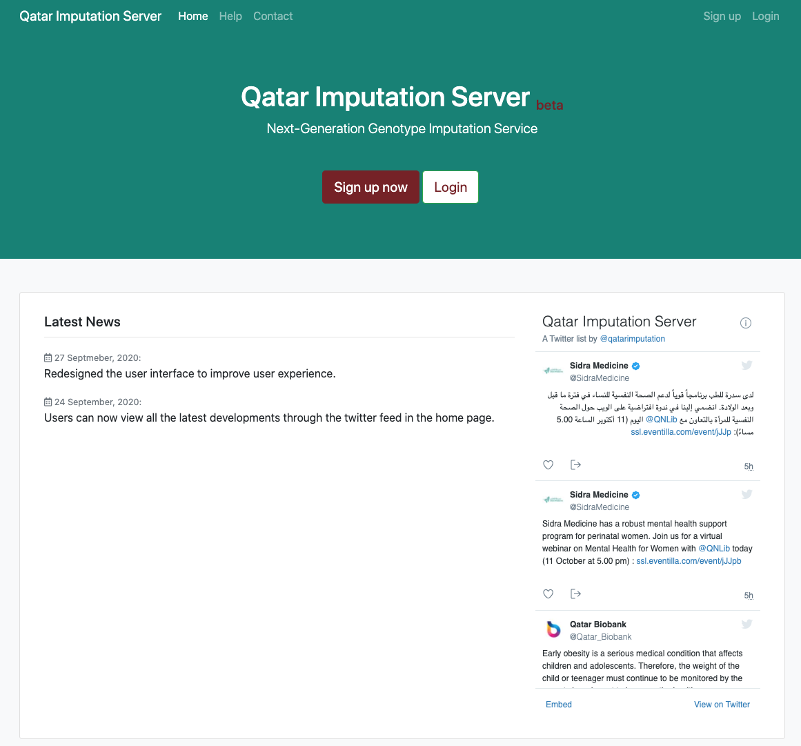

# Qatar Imputation Server  beta 

Qatar Imputation Server provides a free genotype imputation service using Minimac4. You can upload phased or unphased GWAS genotypes and receive phased and imputed genomes in return. Our imputation server offers imputation from 1000 Genomes (Phase 1 and 3), CAAPA, HRC and the TOPMed reference panel. For all uploaded datasets an extensive QC is performed.

 <!-- .element height = "50%" width = "50%" -->